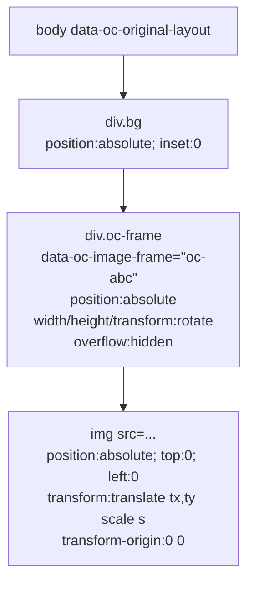

# Canvas Image Frames ("Frame mode" + "Inside-frame mode") — Implementation Plan

## 1. Executive summary

- **Building:** Canva-style image frames in canvas refine mode. Two interactions on the same ``: **Frame mode** (drag/resize/rotate the visible window with 8 handles + 1 rotate, identical UX to text layers), and **Inside-frame mode** (double-click → pan/zoom the photo *inside* the window, with cursor anchoring on wheel). Free-aspect frame resize by default; Shift locks to the image's natural aspect.
- **Explicitly NOT building (v1):** multi-touch pinch-to-zoom (only Cmd/Ctrl+wheel + plain wheel), filters/adjustments (brightness/contrast/saturation), shape/mask cropping (non-rectangular frames), per-image rotate-inside-frame, smart object replacement ("swap photo"), `<video>` framing, multi-frame group transforms.
- **Single most important architectural decision:** **The frame is the *parent wrapper* of the ``, never a transform on the `` itself.** The runtime mounts a `oc-frame` wrapper `<div>` (with `overflow:hidden` and the frame's `transform: translate + width/height + rotate`) around the original ``. The `` keeps its existing CSS but gets an additional `transform: translate(tx, ty) scale(scale)` applied via inline style. Two transforms, two elements, one logical layer. This mirrors how every real frame editor (Figma, Keynote, Canva) models the same problem and side-steps the impossible "crop a single element with overflow:hidden + free transforms" trap.
- **Override storage:** a NEW `images: Record<string, ImageOverride>` map sibling to `layers` in `CanvasOverrides` (rejected: union-typing `CanvasLayer`). Two cleanly typed maps; lock check is `layers || images` non-empty.
- **WYSIWYG contract preserved:** `applyOverrides()` gets an "image" pass that emits the wrapper-`<div></div>` structure for export mode (Puppeteer has no runtime). Preview mode still lets the runtime mutate the live DOM. Same `mode: "preview" | "export"` switch the text path already uses (BUG-021 lineage).
- **Coexistence with text editor:** `applyTransform` is split into `applyTextTransform` (current, in-flow translate from `naturalRect`) and `applyImageTransform` (new, sets wrapper width/height + image inner transform). Dispatch happens in the runtime's message handler keyed on `entry.kind === "image-frame"` vs `entry.kind === "text"`. The two never share a code path beyond the message dispatcher, which keeps both safe.

---

## 2. Architecture decisions

### Q1 — Layer-id derivation for images

**Decision: reuse the same id space (`oc-{hash53}`), but add an `isImageFrame()` discriminator that runs BEFORE `isTextLeaf()` in `tagAndMeasureLayers`. The hash input changes from `tag|cssPath` to `tag|cssPath` for both — *but* image-frame entries get registered with `kind: "image-frame"` so all downstream logic dispatches correctly.**

Rationale:
- The hash function is a pure function of `(tag, cssPath)`. An `` and a `<h1>` at the same DOM position can never collide because `tag` differs, so collisions are impossible by construction.
- Single id space means `CanvasOverrides.layers` (text) and `CanvasOverrides.images` (image-frame) cannot accidentally key the same id. We add a runtime invariant: `Object.keys(images) ∩ Object.keys(layers) === ∅`. Violation → `console.warn` and last-write-wins.
- `isTextLeaf()` already excludes `` via `SKIP_TAGS` (line 77 of `editor-runtime.ts`), so we don't have to remove anything — we just add a new positive-list test that runs first.

Rejected: separate id namespace (`oc-img-{hash}`). Adds string-handling drag for no benefit; the `(tag, cssPath)` hash already disambiguates.

### Q2 — Wrapping strategy: DOM wrap vs. parent-as-frame

**Decision: hybrid with detection — prefer (b) "use the existing positioned parent as the frame" when the parent is structurally a frame; fall back to (a) "wrap in DOM" when not.**

The runtime's `isImageFrame()` does this:

```ts
function detectImageFrame(img: HTMLImageElement): {
  el: HTMLElement;  // the element to use as the FRAME (wrapper)
  innerImg: HTMLImageElement;
  wrapped: boolean; // true if we synthesized the wrapper, false if reused parent
}
```

Heuristic:

1. Look at `img.parentElement`. If it has `overflow: hidden` (computed) AND its only "visual" child is this `` (other children are absolutely-positioned overlays or zero-area decorative spans), **reuse it** as the frame. Examples that match: `<div class="bg" style="overflow:hidden"></div>`, `<div class="t"></div>` where `.t` already has `overflow:hidden`.
2. Otherwise, **wrap**: create `<div class="oc-frame" data-oc-image-wrap>`. Move the `` inside. Copy the ``'s computed `width`, `height`, `border-radius`, `position`, `top/left/right/bottom`, `transform-origin`, and `margin` to the new wrapper. Set `` to `position:absolute; top:0; left:0; width:auto; height:auto; max-width:none; max-height:none;` and apply the natural-cover initial calibration (see §9).

Rationale:
- Pure (a) breaks every existing slide where Claude wrote `.bg img { width:100%; height:100% }` — the moment we wrap, the selector no longer matches because `` is no longer a direct child of `.bg`.
- Pure (b) fails for Claude's most common pattern `` placed directly inside a flex container that is NOT itself a frame (its overflow is `visible`, it sits in flow). Forcing that container into `overflow:hidden` would clip its sibling text.
- Hybrid keeps the common case (Claude's wrapped images) seam-free and degrades gracefully for unusual layouts.

Rejected:
- Pure (a). Fails on every "object-fit:cover with parent selector" slide.
- Pure (b). Half of authored images have no useful parent.
- A third option ("force overflow:hidden on the parent without DOM mutation") was considered and rejected because changing a flex container's overflow can suppress overlay tooltips, badges, and decorative pseudo-elements that were intentionally allowed to overflow.

### Q3 — Frame override storage shape

**Decision: parallel `images: Record<string, ImageOverride>` map alongside the existing `layers` map.**

```ts
interface CanvasOverrides {
  layers: Record<string, CanvasLayer>;            // text only (existing)
  images: Record<string, ImageOverride>;          // NEW
  order: string[];                                // unified — text + image ids
  schemaVersion: 2;                               // bump from 1
}
```

Rationale:
- `CanvasLayer` already carries `style: LayerStyle` (font-only) and `text?: string`. Cramming `image: { scale, tx, ty, src? }` and `frame: { … }` into it forces every text-layer consumer to discriminate on `kind`. Two maps with one shared `order` array is cheaper.
- The `order` array stays unified so z-index works across mixed text/image layers (e.g. user can send a text layer behind an image frame).
- `schemaVersion: 2` triggers a one-shot migration in `carousels.ts:loadCarousels` (`schemaVersion === undefined || 1 → upgrade; images = {}`). Backward compat is trivial because adding an empty `images` map is a no-op for `applyOverrides`.

Rejected:
- Union into `CanvasLayer`. Forces every text-only call site (Inspector style controls, `applyOverrides`'s text replica emission, undo equality checks) to defend against a mode switch they shouldn't care about. Drives complexity into the dozens of places that consume layers.
- Keep two independent `order` arrays. Breaks unified z-index reasoning; user can't z-shuffle a text layer past an image frame.

### Q4 — Inside-frame mode UX

**Decision: combine three cues simultaneously.**

1. **Cursor:** `grab` on hover, `grabbing` while panning. Differentiates from frame-mode's default `move` cursor.
2. **Frame outline color:** in frame mode it's the brand yellow dashed; in inside-frame mode it switches to **solid blue (#3B82F6)** with a thicker stroke (3px → 4px). Drawn by `SelectionOverlay`.
3. **Inspector mode toggle:** the right-side panel shows two segmented buttons at the top: **"Frame"** and **"Image inside"**. Clicking the segment is equivalent to double-click / Esc. The panel below shows mode-relevant controls (frame: position/size/rotation; image: scale slider, tx/ty readout, "Reset image position" button, "Replace image" button [disabled in v1]).

Rejected the floating "Move image · Esc to exit" pill — too noisy, gets in the way of the actual edit. The inspector segmented control + cursor + outline are sufficient and don't occlude the canvas.

Mode entry/exit:
- Enter inside-frame: double-click (within 250ms; ≥5px apart), or click inspector "Image inside" segment, or press `Enter` while a frame layer is selected.
- Exit: click outside the frame, press `Esc`, click inspector "Frame" segment, or select another layer.
- Single-click on an already-selected frame stays in frame mode (rules out the BUG-010 trap).

### Q5 — Cropping math

**Decision: initial calibration = "object-fit: cover", and we ENFORCE minimum `image.scale` such that the image always covers the frame (no letterboxing).**

The runtime tracks per-layer:

```ts
interface ImageEntry {
  frame: { w: number; h: number; ... };  // current frame box
  natural: { w: number; h: number };      // .naturalWidth, .naturalHeight
  scale: number;                          // current image scale, ≥ minScale
  tx: number; ty: number;                 // current image translate (px in slide coords)
}
```

**Initial calibration** (computed once on first selection or when `applyOverrides` materializes the layer):

```ts
const coverScale = Math.max(frame.w / natural.w, frame.h / natural.h);
scale = coverScale;
// center the image in the frame
const renderedW = natural.w * scale;
const renderedH = natural.h * scale;
tx = (frame.w - renderedW) / 2;
ty = (frame.h - renderedH) / 2;
```

This matches `object-fit: cover; object-position: center` exactly, so the moment a user enters refine mode they see the same pixels Claude rendered — no surprise reflow.

**Frame resize:** image scale **does not change**. We re-clamp `tx`, `ty` so the image still covers the new frame:

```ts
const minScale = Math.max(frame.w / natural.w, frame.h / natural.h);
if (scale < minScale) scale = minScale;          // grow image just enough to cover
const renderedW = natural.w * scale;
const renderedH = natural.h * scale;
tx = clamp(tx, frame.w - renderedW, 0);          // tx ≤ 0; right edge ≥ frame right
ty = clamp(ty, frame.h - renderedH, 0);
```

When the user grows the frame past the image's current rendered size, the auto-bump-`scale` rule kicks in. The user-facing rule: **the image always covers the frame**.

**Image scale (inside-frame mode wheel):**

```ts
const minScale = Math.max(frame.w / natural.w, frame.h / natural.h);
const newScale = clamp(prevScale * factor, minScale, 8);  // hard max 8x
// cursor-anchored: keep the pixel under the cursor stationary
const cursorImgX = (cursorX - prevTx) / prevScale;
const cursorImgY = (cursorY - prevTy) / prevScale;
tx = cursorX - cursorImgX * newScale;
ty = cursorY - cursorImgY * newScale;
// then re-clamp tx, ty as in resize math above
```

**Edge cases:**
- **Image smaller than frame on initial load** (`natural.w < frame.w` AND `natural.h < frame.h` after the cover scale): the cover formula already handles this correctly — `coverScale > 1`. We're upscaling; quality may suffer but no letterbox.
- **Image with zero `naturalWidth`** (still loading): the runtime's `tagAndMeasureLayers` skips frames where `naturalWidth === 0`, registers an `` `load` listener, and re-tags on load. Documented limitation: a slide with a slow-loading image will not be selectable as a frame for ~half a second.
- **Frame resized to zero**: enforce `frame.w >= 8 && frame.h >= 8` (matches existing text-layer 4px floor, slightly larger because we need handle-grab area).
- **User rotates the frame inside-frame**: rotation lives on the wrapper. The image inside is **not counter-rotated** — the photo rotates with the frame. This matches Canva's behavior. (We do *not* offer "rotate image inside frame" in v1.)

**Decision: no letterbox is allowed.** A "fit instead of cover" mode is a v2 candidate.

### Q6 — Pinch-to-zoom

**Decision: v1 = `wheel` + `Cmd/Ctrl+wheel`. Touch pinch is v2.**

- Plain `wheel` (deltaY) in inside-frame mode → zoom (cursor-anchored). One wheel notch = ~10% scale change.
- `Cmd/Ctrl+wheel` is also zoom (mac trackpad pinch surfaces as `wheel { ctrlKey: true }`). Same handler.
- **In FRAME mode**, `wheel` is forwarded to the parent so the slide preview can scroll/zoom the canvas viewport (existing behavior preserved).

The runtime distinguishes via `currentMode === "inside-frame"`. `preventDefault()` only when in inside-frame mode AND the cursor is over the active frame.

Touch (`touchstart`/`touchmove` with two fingers) is documented as v2 — straightforward to add later via `event.touches[0]/[1]` distance ratio, but not worth the testing matrix in v1.

### Q7 — Aspect ratio of frame

**Confirmed: free by default. Hold Shift during corner-handle drag = lock to IMAGE's natural aspect (`natural.w / natural.h`), not current frame aspect.**

Rationale: if a user wants to "make this photo bigger without distorting it," that's the natural-aspect lock — they're scaling the source image. Locking to current frame aspect would just preserve any prior crop, which is rarely what the user wants when holding Shift.

Edge handles (top/bottom/left/right midpoints) ignore Shift — they always free-resize one dimension. Matches text-layer convention.

### Q8 — Conflict with text editor's `naturalRect` translate strategy

**Decision: split into `applyTextTransform` (current implementation, unchanged) and `applyImageTransform` (new). Dispatch in the message handler.**

The two are fundamentally different:
- Text needs to stay in flow — `transform: translate()` from `naturalRect` so siblings don't collapse, no `position:absolute`, no `overflow:hidden`.
- Image frames need to be *out of flow* on the wrapper — `position:absolute` (when synthesized) OR rely on the existing parent's positioning (when reused). `overflow:hidden` is essential.

The `LayerEntry` interface gets a `kind: "text" | "image-frame"` field. The message handler in `editor-runtime.ts:onMessage` dispatches:

```ts
if (entry.kind === "image-frame") {
  applyImageTransform(id, payload.frame, payload.image);
} else {
  applyTextTransform(id, payload.transform);  // existing
}
```

The two never share state. Text overrides never touch `entry.naturalRect` for image frames; image overrides never touch text wrappers.

Rejected: a single polymorphic `applyTransform` with branches inside. Bug surface area is too high — image fixes risk regressing text, and vice versa. The text editor already has 5 blocker bugs in the audit; we don't want to compound.

### Q9 — Export rendering

**Decision: extend `applyOverrides({ mode: "export" })` with a new image pass that ALWAYS emits the wrapper-`<div></div>` structure for any image with an override.**

In export mode, for each image override the helper:

1. Uses the existing `scanSlideHtml()` walker to find the original `` element by hashed id.
2. Replaces the `` tag in the source HTML with:
   ```html
   <div data-oc-image-frame="{id}" style="position:absolute;left:{fx}px;top:{fy}px;width:{fw}px;height:{fh}px;transform:rotate({rot}deg);overflow:hidden;z-index:{z}">
     
   </div>
   ```
3. The original ``'s `<style>`-tag selectors (e.g. `.bg img { width:100%; ... }`) might still match — to avoid collision, we set the inner `` to `class=""` (drop classes) AND include an `<style>` block at the top that resets `[data-oc-image-frame] img { width:auto !important; height:auto !important; max-width:none !important; max-height:none !important; object-fit:initial !important; object-position:initial !important; }`.

Preview mode in the editor iframe does NOT do the splice — the runtime synthesizes the wrapper at boot and the parent feeds image overrides via postMessage (mirrors how Phase 4 BUG-002-style decoupling should already work for text).

For Phase 1 we accept that the export's splice is byte-modifying source HTML (existing `applyOverrides` only injects/appends; it never deletes). Test fixtures must include a slide where the original image had selectors like `.bg img` to lock down the regression.

### Q10 — Frame on `background-image` CSS

**Decision: YES for v1. Auto-detect any element with a non-empty computed `background-image: url(...)` (and no `` child of its own) and treat it as a frame.**

Rationale:
- The data shows ~150 slides use `background-image: url('/uploads/...')` — same order of magnitude as `` tags. Skipping them halves the feature's coverage.
- The implementation cost is small: detection is one `getComputedStyle().backgroundImage !== "none"` check; the wrapper exists already (the element itself). The "image" we transform is the CSS background, applied via `background-position` and `background-size` instead of inner `` transform.
- Cropping math is identical (`background-size: {scale * naturalW}px {scale * naturalH}px; background-position: {tx}px {ty}px;`).
- We DO need the image's natural dimensions for calibration. We resolve this by issuing a one-shot `Image()` preload at boot (inside the iframe) to read `naturalWidth/naturalHeight`; results cached by URL.

Rejected: defer to v2. The data justifies the work, and bolting it on later means a second round of testing the entire calibration math.

Caveat: `background-image: linear-gradient(...)` and SVG-data-URI backgrounds are NOT framed — the detection ignores anything that isn't a single `url(...)` value. CSS gradients stay as-is.

---

## 3. Data model changes

### `src/types/carousel.ts`

```ts
// NEW — frame transform
export interface FrameTransform {
  x: number;        // px from slide top-left, slide coords
  y: number;
  w: number;
  h: number;
  rotation: number; // degrees
  z: number;
}

// NEW — image-inside-frame transform
export interface ImageInnerTransform {
  scale: number;    // multiplier on natural dimensions
  tx: number;       // translate x in frame-local coords (slide px)
  ty: number;
}

// NEW — full image override
export interface ImageOverride {
  id: string;
  kind: "image-frame";
  frame: FrameTransform;
  image: ImageInnerTransform;
  /**
   * Captured at first override for stability. The image's intrinsic dimensions
   * inform the cover-scale math; without this captured value, an image whose
   * src is later swapped (out of band) would silently re-calibrate.
   */
  natural: { w: number; h: number };
  /**
   * Strategy used when the runtime first encountered the image:
   *   "wrapped" — runtime synthesized a wrapper <div>; export must do the same
   *   "parent"  — runtime reused the existing parent as the frame; export
   *               splices `overflow:hidden` and width/height onto that parent
   *               instead of synthesizing a new wrapper
   *   "background" — the framed thing is a CSS `background-image` on a div;
   *               export updates `background-size`/`background-position`/`background-repeat:no-repeat`
   */
  source: "wrapped" | "parent" | "background";
}

export interface CanvasOverrides {
  layers: Record<string, CanvasLayer>;
  images: Record<string, ImageOverride>;   // NEW
  order: string[];                          // unified across both maps
  schemaVersion: 2;                         // bumped from 1
}
```

### `src/types/canvas.ts`

Add to the parent → iframe union:

```ts
| { type: "oc:editor:apply-image-transform";
    payload: { id: string; frame?: Partial<FrameTransform>; image?: Partial<ImageInnerTransform> } }
| { type: "oc:editor:set-frame-mode";
    payload: { id: string; mode: "frame" | "inside-frame" } }
| { type: "oc:editor:reset-image-position";
    payload: { id: string } }
```

Add to the iframe → parent union:

```ts
| { type: "oc:editor:image-frame-init";
    payload: { id: string; natural: { w: number; h: number }; source: ImageOverride["source"]; frame: FrameTransform; image: ImageInnerTransform } }
| { type: "oc:editor:image-pan";
    payload: { id: string; image: ImageInnerTransform } }     // emitted during inside-frame drag
| { type: "oc:editor:image-zoom";
    payload: { id: string; image: ImageInnerTransform } }     // emitted on wheel zoom
```

`MeasuredLayer` gains `kind: "text" | "image-frame"`.

### `src/lib/carousels.ts`

- `loadCarousels()`: migrate `schemaVersion === undefined | 1` overrides by setting `images: {}`.
- `updateSlide()`: round-trip `canvasOverrides.images`.
- `setCanvasOverrides()`: unchanged signature; merges new map.
- `undoSlide()`: unchanged (already structurally cloning).
- `isSlideLocked()` (currently in route.ts) — extracted to `src/lib/carousels.ts` and updated:

```ts
export function isSlideLocked(slide?: Pick<Slide, "canvasOverrides">): boolean {
  const o = slide?.canvasOverrides;
  if (!o) return false;
  const layerCount = Object.keys(o.layers ?? {}).length;
  const imageCount = Object.keys(o.images ?? {}).length;
  return layerCount + imageCount > 0;
}
```

### `src/lib/chat-system-prompt.ts`

The locked-slide flag already keys off `canvasOverrides.layers` length. Update line ~167's check to use the new shared `isSlideLocked()` helper. Wording stays identical — Claude doesn't care which kind of override exists.

---

## 4. API surface changes

### Modified: `PUT /api/carousels/[id]/slides/[slideId]/route.ts`

- Body accepts `canvasOverrides.images`. Already accepts `canvasOverrides`; adding the field is type-only.
- Lock check switched from inline `Object.keys(layers).length > 0` to `isSlideLocked(existing)`.
- DELETE handler: same swap.

### Unchanged: `POST /unlock`

- `keepText=true` already calls `applyOverrides(slideHtml, overrides, { mode: "export" })` to bake. After Phase 1 of this work, that call ALSO bakes image frames automatically — no route change.
- `keepText=false` clears all overrides.

### Unchanged: `/export`, `/video`, `/undo`

All call `wrapSlideHtml(slide.html, ratio, { overrides: slide.canvasOverrides, mode: "export" })`. `applyOverrides` is the seam; routes don't need to know about images.

### New (optional, v1.5): `POST /api/carousels/[id]/slides/[slideId]/image-replace`

Reserved for future "swap photo in this frame" feature. Out of scope for v1.

---

## 5. UI components

### New components — all in `src/components/editor/canvas/`

| File | Lines (target) | Responsibility |
|---|---|---|
| `ImageFrameInspector.tsx` | ~200 | Right-panel section shown when selected layer is `kind: "image-frame"`. Segmented "Frame / Image inside" toggle; mode-relevant controls (position/size/rotation in frame mode; scale slider, "Center image", "Reset image position", "Fit image to frame" in inside-frame mode). |
| `useImageFrameDrag.ts` | ~180 | Hook factored out of CanvasEditor: handles inside-frame pan + wheel zoom logic. Pure math; takes `(frame, image, eventDelta) → newImage`. |
| (no new bundled runtime file) | — | Extends existing `editor-runtime.ts` (split into multiple TS modules at build time if it crosses 600 lines; see §11 phase 1). |

### Modified components

- **`CanvasEditor.tsx`** (currently 1308 lines — already over the 300-line guideline; do NOT add to it without splitting). Refactor recommendation: extract a `useImageFrames.ts` hook (~120 lines) that owns the `images: Record<string, ImageOverride>` slice, mirrors what the existing layer-mutation code does for text. CanvasEditor delegates image-related messages to this hook.

  Specifically split out of CanvasEditor:
  - `useTextLayers.ts` — current `mutateLayer`, `getOrSeedLayer`, `setOverrides` for the `layers` map.
  - `useImageFrames.ts` — equivalent for the `images` map.
  - `useFrameMode.ts` — owns `currentMode: "frame" | "inside-frame" | null` plus the keyboard/dblclick state machine.

  The CanvasEditor shell drops to ~400 lines, still over budget but moving in the right direction.

- **`SelectionOverlay.tsx`** — reads the active layer's `kind`. For image frames it draws:
  - In frame mode: same 8 handles + rotate as text, but corner handles draw the resize cursor (`nwse-resize`/`nesw-resize`); outline is dashed yellow.
  - In inside-frame mode: NO resize handles (frame is locked while editing inside). Outline is solid blue, 4px stroke. Cursor over the frame body is `grab`/`grabbing`.

- **`Inspector.tsx`** — top-level conditional: if selected layer is text, render existing controls; if image-frame, render `<ImageFrameInspector>`.

- **`LayersPanel.tsx`** — show an image icon next to image-frame layers in the list.

- **`useCanvasMessages.ts`** — add handlers for the three new iframe → parent messages.

- **`useCanvasUndo.ts`** — undo entries already snapshot the entire `CanvasOverrides` blob; adding `images` to that blob is automatic.

### Files NOT touched

- `RefineModeToggle.tsx`, `KeyboardHelpOverlay.tsx`, `useSnap.ts` (snap math operates on rects which are kind-agnostic).

---

## 6. Rendering pipeline

### Mermaid: frame structure

```mermaid
flowchart TD
  Slide[Slide<br/>html + canvasOverrides] -->|wrapSlideHtml| Wrap[wrapSlideHtml<br/>html + applyOverrides]
  Wrap -->|preview/refine| Iframe[Iframe<br/>+ runtime tags &lt;img&gt;<br/>+ wraps in oc-frame divs]
  Wrap -->|export| Pup[Puppeteer<br/>applyOverrides mode=export<br/>splices wrapper into HTML string]
  Pup --> PNG[PNG / MP4]
  Iframe -->|postMessage<br/>image-pan/zoom| Parent[Parent state<br/>updates ImageOverride]
  Parent -->|debounced PUT| API[/PUT /slides/[id]/]
```

### Frame DOM structure (after wrap)



When `source: "parent"`, the `oc-frame` wrapper IS `.bg` (no synthesized div). When `source: "background"`, there is no `` inside — the frame element has `background-image` and `background-size`/`-position` driven by the override.

### `wrapSlideHtml()` changes (file: `src/lib/slide-html.ts`)

- No signature change.
- `applyOverrides` is called with `mode` as today. Adds an internal `applyImageOverrides(slideHtml, overrides.images, mode)` step before the existing text-replica step.

### `applyOverrides()` changes (file: `src/lib/canvas-overrides.ts`)

New function:

```ts
function applyImageOverrides(
  slideHtml: string,
  images: Record<string, ImageOverride>,
  mode: "preview" | "export"
): string
```

**Preview mode**: returns `slideHtml` unchanged (runtime handles wrapping). Tags the body with a `<style>` block reserving baseline rules for `[data-oc-image-frame]`.

**Export mode**: walks `slideHtml` with the existing `scanSlideHtml()`. For each image override:

1. Find the original `` element by hashed id.
2. Compute the wrapper HTML based on `source`:
   - `wrapped`: emit `<div data-oc-image-frame …></div>` and DELETE the original `` tag (splice replace).
   - `parent`: find the immediate parent of the `` in the source HTML. Mutate its inline style to add `overflow:hidden; width: {fw}px; height: {fh}px; transform: translate({fx-naturalParentX}px, {fy-naturalParentY}px) rotate({rot}deg);`. Add inline transform to the `` itself.
   - `background`: find the element by id. Mutate its inline style: `background-size: {scale*natW}px {scale*natH}px; background-position: {tx}px {ty}px; background-repeat:no-repeat; overflow:hidden; width: {fw}px; height: {fh}px;` plus the frame transform.
3. Splice in descending-byte-offset order (same trick as `exportInjections`).

The function inherits the existing `scanSlideHtml`'s limitations (well-formed HTML only, no `<svg>` recursion). Add a unit test that locks down all three `source` modes.

---

## 7. Edit-mode runtime (changes to `src/lib/editor-runtime.ts`)

### Detection pass (added to `tagAndMeasureLayers`)

After Pass 1 (replicas) and before Pass 2 (text leaves), insert **Pass 1.5 — image frames**:

```ts
const imgs = document.body.querySelectorAll<HTMLImageElement>("img:not([data-oc-no-frame])");
for (let i = 0; i < imgs.length; i++) {
  const img = imgs[i];
  if (img.naturalWidth === 0) {
    img.addEventListener("load", () => { tagAndMeasureLayers(); sendLayout(); }, { once: true });
    continue;
  }
  const detected = detectImageFrame(img);  // see Q2
  const id = hashLayerId("img", cssPathOf(img));
  if (layerById.has(id)) continue;          // collision guard
  registerImageFrame(id, detected);
}

// background-image pass
const allDivs = document.body.querySelectorAll<HTMLElement>("*:not([data-oc-no-frame])");
for (... bg-image detection ...) { ... }
```

`registerImageFrame()` populates a new `ImageEntry` per layer:

```ts
interface ImageEntry {
  id: string;
  kind: "image-frame";
  source: "wrapped" | "parent" | "background";
  frameEl: HTMLElement;           // wrapper (synthesized or reused)
  innerEl: HTMLElement | null;    //  for wrapped/parent; null for background
  natural: { w: number; h: number };
  rect: Rect;                     // current frame rect for hit-test
  // current applied transform (mirrors ImageOverride)
  frame: FrameTransform;
  image: ImageInnerTransform;
}
```

### `detectImageFrame()` — full algorithm

```ts
function detectImageFrame(img: HTMLImageElement): {
  source: "wrapped" | "parent";
  frameEl: HTMLElement;
  innerEl: HTMLImageElement;
} {
  const parent = img.parentElement;
  if (parent && parent !== document.body) {
    const cs = getComputedStyle(parent);
    const onlyVisualChild = isOnlyVisualChild(parent, img);
    const overflowHidden = cs.overflow === "hidden" || cs.overflowX === "hidden" || cs.overflowY === "hidden";
    if (onlyVisualChild && overflowHidden) {
      return { source: "parent", frameEl: parent, innerEl: img };
    }
  }
  // Wrap path
  const wrap = document.createElement("div");
  wrap.setAttribute("data-oc-image-wrap", "1");
  // Copy positioning so the wrapper sits exactly where  sat
  const cs = getComputedStyle(img);
  wrap.style.position = cs.position === "static" ? "relative" : cs.position;
  wrap.style.top = cs.top; wrap.style.left = cs.left;
  wrap.style.right = cs.right; wrap.style.bottom = cs.bottom;
  wrap.style.width = cs.width; wrap.style.height = cs.height;
  wrap.style.margin = cs.margin;
  wrap.style.overflow = "hidden";
  wrap.style.borderRadius = cs.borderRadius;
  // Mount
  img.parentElement!.insertBefore(wrap, img);
  wrap.appendChild(img);
  // Reset img to absolute fill
  img.style.position = "absolute";
  img.style.top = "0"; img.style.left = "0";
  img.style.width = "auto"; img.style.height = "auto";
  img.style.maxWidth = "none"; img.style.maxHeight = "none";
  // Initial cover-scale calibration (Q5)
  const fw = parseFloat(cs.width) || wrap.clientWidth;
  const fh = parseFloat(cs.height) || wrap.clientHeight;
  const cover = Math.max(fw / img.naturalWidth, fh / img.naturalHeight);
  img.style.transformOrigin = "0 0";
  img.style.transform = `translate(${(fw - img.naturalWidth * cover) / 2}px, ${(fh - img.naturalHeight * cover) / 2}px) scale(${cover})`;
  return { source: "wrapped", frameEl: wrap, innerEl: img };
}
```

`isOnlyVisualChild(parent, img)` — returns true iff every other child of `parent` either has zero bounding-rect OR has `position: absolute` with a positive z-index (overlays, badges).

### Hit-test

`hitTest(x, y)` walks `layerOrder`, returns the topmost layer whose rect contains the point. Already kind-agnostic — no change needed beyond ensuring image-frame entries register their wrapper rect correctly.

### `applyImageTransform()` — new function

```ts
function applyImageTransform(
  id: string,
  framePartial?: Partial<FrameTransform>,
  imagePartial?: Partial<ImageInnerTransform>
): void {
  const entry = imageById.get(id);
  if (!entry) return;
  if (framePartial) {
    Object.assign(entry.frame, framePartial);
    const f = entry.frame;
    // For "wrapped" source, position:absolute is set by detectImageFrame; for
    // "parent" source we trust the existing positioning context. Translate
    // delta is from the natural rect of the frame element when first measured.
    const dx = f.x - entry.naturalFrameRect.x;
    const dy = f.y - entry.naturalFrameRect.y;
    const transforms: string[] = [];
    if (dx !== 0 || dy !== 0) transforms.push(`translate(${dx}px,${dy}px)`);
    if (f.rotation !== 0) transforms.push(`rotate(${f.rotation}deg)`);
    entry.frameEl.style.transform = transforms.join(" ") || "";
    if (Math.abs(f.w - entry.naturalFrameRect.w) > 1) entry.frameEl.style.width = `${f.w}px`;
    if (Math.abs(f.h - entry.naturalFrameRect.h) > 1) entry.frameEl.style.height = `${f.h}px`;
  }
  if (imagePartial) {
    Object.assign(entry.image, imagePartial);
    const i = entry.image;
    // Re-clamp to keep cover invariant (Q5)
    const minScale = Math.max(entry.frame.w / entry.natural.w, entry.frame.h / entry.natural.h);
    if (i.scale < minScale) i.scale = minScale;
    const renderedW = entry.natural.w * i.scale;
    const renderedH = entry.natural.h * i.scale;
    i.tx = clamp(i.tx, entry.frame.w - renderedW, 0);
    i.ty = clamp(i.ty, entry.frame.h - renderedH, 0);
    if (entry.source === "background") {
      entry.frameEl.style.backgroundSize = `${renderedW}px ${renderedH}px`;
      entry.frameEl.style.backgroundPosition = `${i.tx}px ${i.ty}px`;
      entry.frameEl.style.backgroundRepeat = "no-repeat";
    } else if (entry.innerEl) {
      entry.innerEl.style.transform = `translate(${i.tx}px,${i.ty}px) scale(${i.scale})`;
    }
  }
  entry.rect = entry.frameEl.getBoundingClientRect();
}
```

### Mode-switching state

The runtime keeps `let currentMode: "frame" | "inside-frame" | null = null;` and `let activeFrameId: string | null = null;`.

- Parent → iframe `oc:editor:set-frame-mode` `{ id, mode }` toggles cursor (`grab`/`default`) and outline (visual cue is in parent SVG, but cursor MUST change inside the iframe so the user gets it during pointer hover).
- In `inside-frame` mode, the runtime intercepts `pointerdown`/`pointermove` on the active frame: instead of forwarding `oc:editor:pointer-down/move` (which the parent uses to select/drag the frame), it emits `oc:editor:image-pan` `{ id, image: { tx, ty, scale } }`.
- `wheel` events: when in `inside-frame` mode AND target is inside `activeFrameEl`, `preventDefault()` and emit `oc:editor:image-zoom`. Cursor-anchored math runs **inside the runtime** so we don't need a parent round-trip per wheel notch.

### Full new postMessage messages

Already enumerated in §3. The runtime handles:

- `oc:editor:apply-image-transform` (parent → iframe) — frame and/or image partials.
- `oc:editor:set-frame-mode` (parent → iframe) — switches active frame's cursor + intercept behavior.
- `oc:editor:reset-image-position` (parent → iframe) — re-runs cover calibration.

The runtime emits:

- `oc:editor:image-frame-init` (per frame at boot) — parent uses payload to seed `ImageOverride` on first edit.
- `oc:editor:image-pan` / `oc:editor:image-zoom` — parent updates state + debounced PUT.

### DOM mutation strategy summary

| Source | Boot-time mutation | Cleanup on exit refine? |
|---|---|---|
| `wrapped` | Insert `<div.oc-frame>` wrapper, move `` inside, reset `` style, apply cover transform. | Yes — unwrap on iframe destroy. Stored in `previousVersions` snapshot includes the wrapper-applied state via export-mode `applyOverrides`. |
| `parent` | Stash original `position`, `overflow`, `width`, `height` of parent into `data-oc-original-style` JSON attribute. Set `overflow:hidden`. Apply cover transform to ``. | Yes — restore from stash on iframe destroy. |
| `background` | Read computed `backgroundImage` URL. Preload to get `naturalWidth/Height`. Apply cover via `background-size`/`background-position`. | Yes — restore via stash. |

The "stash and restore" mechanism guarantees that exiting refine mode without saving leaves the live DOM byte-identical to its pre-mount state. No data-loss surprises.

---

## 8. Interaction details

### Frame mode

- **Select:** click on a frame → 8 handles + 1 rotate appear in `SelectionOverlay`. Outline is dashed yellow.
- **Drag (body):** pointer-down on frame body, pointer-move ≥3px → translate the frame. Same `DRAG_THRESHOLD_PX` as text (BUG-005 lineage). Snap to other frames + slide edges via existing `useSnap`.
- **Resize (corner handle, no Shift):** free aspect.
- **Resize (corner handle, Shift):** locks to `natural.w / natural.h`. Visual indicator: corner handle turns blue, tooltip "Locked to image aspect" appears for 600ms.
- **Resize (edge handle):** free, single-axis. Shift ignored.
- **Rotate (top handle):** continuous; Shift snaps to 15°.
- **Crop preview:** the image inside re-clamps in real-time (`applyImageTransform({ frame: ... })` triggers the clamp). User sees the visible window change but the image scale doesn't.
- **Keyboard:** Arrow keys nudge frame 1px; Shift+Arrow 10px. `Delete`/`Backspace` removes the override (frame returns to Claude's HTML).

### Inside-frame mode

- **Enter:** double-click the frame, OR press `Enter` while frame is selected, OR click "Image inside" segment in inspector.
- **Cursor:** `grab` when hovering frame body, `grabbing` while dragging.
- **Outline:** solid blue 4px (drawn by SelectionOverlay).
- **Pan:** pointer-down inside frame, pointer-move (no threshold needed — pan is fine-grain) → updates `image.tx, image.ty` with re-clamp.
- **Zoom:** `wheel` (or Cmd/Ctrl+wheel for trackpads) — cursor-anchored, factor = `1 + deltaY / 500` clamped to `[0.5, 2]` per event, re-clamped to `[minScale, 8]` total.
- **Cannot resize/rotate frame** while inside-frame (handles hidden).
- **Exit:** `Esc`, click outside, or "Frame" segment in inspector.
- **Keyboard:** Arrow keys nudge image (not frame!) 1px; Shift+Arrow 10px. `0` resets image to cover-fit. `Cmd/Ctrl+0` same.

### Mode-switching UX

State machine:

```
[frame mode + selection] ──dblclick──→ [inside-frame mode]
       ▲                                       │
       └────esc / outside-click / segment──────┘
```

If the user is in inside-frame mode and clicks a different layer, exit inside-frame first, then process the new selection. (Two-step: protects against a wheel event between ":exit" and ":select" zooming the wrong frame.)

### Snap behavior

- **Frame mode:** snap on the frame's bounding box, identical to text layer snapping (left/center/right + top/middle/bottom against other frames + slide edges).
- **Inside-frame mode:** NO snapping during pan. Pan is intentionally free for fine adjustment. The image *is* clamped to the cover invariant — that's the only "constraint" applied.
- **Pressing `0` in inside-frame mode** = "reset to cover-center" (same as initial calibration). Acts as the only "snap to original" affordance.

### Conflict with text-layer dblclick

Text dblclick → inline edit (BUG-010 fix in audit recommends 250ms + already-selected guard). Image-frame dblclick → inside-frame mode. Same code path, dispatched on `entry.kind`.

The existing dblclick window of 350ms in `editor-runtime.ts:777` should be tightened to 250ms during this work (resolves BUG-010 simultaneously). Add a co-located change.

---

## 9. Cropping math (consolidated)

### Initial calibration (cover-fit, center)

```
coverScale = max(frame.w / natural.w, frame.h / natural.h)
scale = coverScale
renderedW = natural.w * scale
renderedH = natural.h * scale
tx = (frame.w - renderedW) / 2
ty = (frame.h - renderedH) / 2
```

Result: image fully covers frame, centered. Equivalent to `object-fit: cover; object-position: center`.

### Frame resize (image scale unchanged unless forced)

```
minScale = max(frame.w / natural.w, frame.h / natural.h)
scale = max(scale, minScale)            // grow if needed to maintain cover
renderedW = natural.w * scale
renderedH = natural.h * scale
tx = clamp(tx, frame.w - renderedW, 0)
ty = clamp(ty, frame.h - renderedH, 0)
```

### Image scale (wheel in inside-frame, cursor-anchored)

```
factor = 1 + deltaY / 500              // wheel-up zooms in (negative deltaY)
factor = clamp(factor, 0.5, 2)
newScale = prevScale * factor
newScale = clamp(newScale, minScale, 8)
// keep pixel under cursor stationary
cursorImgX = (cursorX - prevTx) / prevScale
cursorImgY = (cursorY - prevTy) / prevScale
tx = cursorX - cursorImgX * newScale
ty = cursorY - cursorImgY * newScale
// re-clamp
tx = clamp(tx, frame.w - newScale * natural.w, 0)
ty = clamp(ty, frame.h - newScale * natural.h, 0)
```

`cursorX, cursorY` are in **frame-local coordinates**: `(eventClientX - frameRect.x, eventClientY - frameRect.y)`. NOT slide coords — frame may be rotated, so use `getBoundingClientRect`-anchored frame coords and assume rotation is approximately zero during inside-frame mode (a 90°-rotated frame edited inside-frame is a v2 edge case; we DO support it geometrically by inverting the rotation transform on cursor coords, but skip implementation in v1; document as known).

### Image pan

```
tx = clamp(prevTx + deltaX, frame.w - renderedW, 0)
ty = clamp(prevTy + deltaY, frame.h - renderedH, 0)
```

`deltaX, deltaY` from successive `pointermove` events in frame-local coords.

### Reset image position (`0` key, "Reset" button)

Re-run initial calibration with current frame and natural sizes. Loses any user pan/zoom.

### Edge cases

| Case | Behavior |
|---|---|
| `natural.w === 0` (image still loading) | Skip frame registration; retry on `load` event |
| Image with EXIF rotation | `naturalWidth/Height` already reflects display orientation (browser de-rotates); no extra math |
| Frame larger than image at scale 1 | `coverScale > 1`; image upscales (blurry but never letterboxed) |
| Frame rotation in inside-frame mode | Pan/zoom use frame-local coords post-rotation; v1 acceptable for rotation ≤ 5° |
| `natural` aspect = frame aspect | Cover scale = both `frame.w/natural.w` and `frame.h/natural.h`; tx and ty both 0 |

---

## 10. Persistence

### Override JSON example

```json
{
  "schemaVersion": 2,
  "layers": { "oc-abc123": { /* text layer */ } },
  "images": {
    "oc-def456": {
      "id": "oc-def456",
      "kind": "image-frame",
      "frame": { "x": 100, "y": 200, "w": 800, "h": 600, "rotation": 0, "z": 11 },
      "image": { "scale": 1.4, "tx": -150, "ty": -80 },
      "natural": { "w": 1200, "h": 800 },
      "source": "wrapped"
    }
  },
  "order": ["oc-def456", "oc-abc123"]
}
```

### Save triggers

- Frame drag/resize/rotate → `oc:editor:apply-image-transform` to runtime AND debounced 350ms PUT.
- Inside-frame pan/zoom → `oc:editor:apply-image-transform` to runtime is unnecessary (the runtime drove the pan/zoom itself; parent only mirrors state). Debounced 350ms PUT for persistence.
- Mode change → no save.
- Slide change / refine exit → flush.

### Undo/redo

`useCanvasUndo` snapshots the entire `CanvasOverrides`. Image and text undo are intermingled in one stack — Cmd-Z cycles backward through every transform (frame and text alike) in chronological order. This matches Canva's per-document undo and is what users expect. Cap stays at 50.

Inside-frame pan creates many small overrides; debounce undo-stack pushes by 500ms during continuous pan/zoom (one undo entry per "burst" of pan, not one per event). Similar pattern to text-layer drag bursts.

### Migration

`loadCarousels()` runs once on disk read:

```ts
function migrateOverrides(o: any): CanvasOverrides | null {
  if (!o) return o;
  if (o.schemaVersion === 2) return o;
  return {
    layers: o.layers ?? {},
    images: {},
    order: o.order ?? Object.keys(o.layers ?? {}),
    schemaVersion: 2,
  };
}
```

Idempotent and lossless. Old slides re-save with v2 the next time anything changes.

---

## 11. Conflict resolution with text editor

### Dispatch in the runtime

`onMessage()` switch already discriminates by `type`. New message types (`oc:editor:apply-image-transform`, `oc:editor:set-frame-mode`, `oc:editor:reset-image-position`) get new branches that route to the image code path. They never touch `layerById` (text entries) — image entries live in a separate `imageById: Map<string, ImageEntry>`.

`hitTest()` walks both maps via the unified `layerOrder` array. Each id resolves to either `layerById.get(id)` or `imageById.get(id)` (collision-free by Q1 invariant).

### Dispatch in the parent

`CanvasEditor` reads `selectedId` and looks up:

```ts
const textLayer = overrides.layers[selectedId];
const imageOverride = overrides.images[selectedId];
const kind: "text" | "image-frame" | null =
  textLayer ? "text" : imageOverride ? "image-frame" : null;
```

`Inspector`, `SelectionOverlay`, and the keyboard handler all receive `kind` and dispatch.

### Lock check

The new shared `isSlideLocked()` (in `src/lib/carousels.ts`) returns true if EITHER `layers` OR `images` non-empty. Used by:
- `chat-system-prompt.ts` (existing call site, swapped helper)
- `route.ts` PUT/DELETE (existing call sites, swapped helper)

No behavioral change for chat — Claude already doesn't know about images vs text and treats `[LOCKED]` opaquely.

---

## 12. Implementation phases

Each phase shippable independently behind the existing refine-mode flag.

### Phase 1 — Data model + export rendering (no UI)

- Add `FrameTransform`, `ImageInnerTransform`, `ImageOverride`, `images` map to `CanvasOverrides`. Bump `schemaVersion: 2`.
- Migration in `carousels.ts`.
- Extract `isSlideLocked()` to `src/lib/carousels.ts`. Update route.ts + chat-system-prompt.ts to use it.
- Add `applyImageOverrides()` in `canvas-overrides.ts` (export-mode splice for all three `source` types).
- Unit tests: `applyOverrides({ images: {...} }, { mode: "export" })` produces correct wrapper HTML for each source type. Round-trip test with a real fixture slide that has both `` and `background-image`.
- Lock guard verified manually: PUT a slide with image overrides without `X-OC-Source: canvas` → 423.

**Effort: 8–10 hours.** Risk: low. The export splice is the trickiest part; budget extra for the `parent` and `background` source variants.

### Phase 2 — Runtime image-frame detection + wrapping

- Add Pass 1.5 in `tagAndMeasureLayers` for `` and `background-image` detection.
- Implement `detectImageFrame()` with hybrid wrapping/parent strategy.
- Implement `registerImageFrame()` and the `imageById` map.
- Implement DOM-state stash (`data-oc-original-style` JSON) and restore-on-unmount hooks.
- Emit `oc:editor:image-frame-init` per detected frame.
- Update `MeasuredLayer` to carry `kind`.
- Manual: open a slide in refine mode, verify console shows image-frame-init for each `` and `background-image`. Verify exiting refine mode restores the original DOM (visual diff against pre-refine).

**Effort: 12–16 hours.** Risk: medium-high. The wrap-vs-parent detection has many edge cases; `isOnlyVisualChild` heuristic may need tuning against real fixtures. The DOM-stash mechanism must be airtight or users lose the un-edited visual on refine-exit.

### Phase 3 — Frame mode (drag/resize/rotate)

- `applyImageTransform()` (frame-only path).
- `SelectionOverlay` reads `kind`, draws image-frame outline (dashed yellow) + handles.
- Wire pointer-down/move/up through existing dispatcher; same `DRAG_THRESHOLD_PX = 3`.
- Resize handles: cover-clamp invariant maintained by `applyImageTransform` (re-clamps `image.tx, ty` on every frame change).
- Shift-resize: lock to `natural.w / natural.h`.
- Inspector: detect `kind === "image-frame"`, render new `ImageFrameInspector` with frame-mode controls only (position, size, rotation, "Reset frame to original size").
- Snap with existing `useSnap`.
- Debounced PUT.
- Manual: drag, resize, rotate a frame; reload page; frame state persists. Export PNG; visual matches refine view to ±1px.

**Effort: 14–18 hours.** Risk: medium. Most risk is in the `parent` source type — we're mutating a Claude-authored element's inline style and need to make sure the cover-clamp doesn't fight the original CSS rules. Add fixture coverage.

### Phase 4 — Inside-frame mode (pan + wheel zoom)

- `currentMode` state machine in runtime + parent.
- Dblclick → enter inside-frame; Esc / outside-click / Enter / segment toggle → exit.
- Cursor change inside iframe (`grab`/`grabbing`).
- Pointer-down/move pan with frame-local coords + clamp.
- `wheel` listener with cursor-anchored zoom math (preventDefault inside frame body).
- Apply image transform updates `` `transform: translate scale` (or `background-size/-position` for `source: "background"`).
- `applyImageTransform()` image-only path.
- `SelectionOverlay` switches to solid blue 4px outline; hides handles.
- `ImageFrameInspector` adds inside-frame controls: scale slider, "Reset image position" button, "Center image" button.
- Tighten dblclick window to 250ms in runtime (BUG-010 fix bundled).
- Manual: dblclick frame, pan with mouse, zoom with wheel, cursor-anchor verified by zooming on a corner pixel and watching it stay still. Reload — pan/zoom state persists.

**Effort: 12–16 hours.** Risk: medium. Cursor-anchored zoom math is fiddly; off-by-pixel issues likely. Trackpad pinch (`ctrlKey: true` wheel) needs separate Safari/Chrome verification.

### Phase 5 — Background-image support

- `background-image` detection in Pass 1.5 (regex `url\(['"]?(.+?)['"]?\)` on computed `backgroundImage`).
- Preload via `new Image()` to get `naturalWidth/Height`; cache.
- `applyImageTransform` `source: "background"` branch (uses `backgroundSize`/`backgroundPosition`).
- Export splice for `background` source.
- Manual: take a fixture slide using `background-image: url(...)`, verify it becomes a frame and obeys all frame/inside-frame interactions.

**Effort: 6–8 hours.** Risk: low (math is identical to img path; only the DOM application differs).

### Phase 6 — Polish, undo bursts, hardening

- Undo-burst debounce (500ms) for inside-frame pan/zoom.
- `KeyboardHelpOverlay` updated with frame/inside-frame shortcuts.
- LayersPanel: image icon for image-frame layers.
- Edge cases: image still loading, image 404, image with zero natural dimensions.
- Visual diff PNG of preview vs export for: (a) wrapped img with text overlays, (b) parent img already in `.bg`, (c) background-image slide.
- Performance: throttle `apply-image-transform` to 60fps during pan/zoom.
- Test fixtures committed.

**Effort: 8–10 hours.** Risk: low.

**Total estimated effort: 60–78 hours** (~8–10 focused days, including the inevitable "the wrap broke this slide" debug sessions).

---

## 13. Risks & open questions

### Known risks

1. **Wrap-vs-parent detection misclassifies.** A slide where Claude wrote `<div class="bg" style="position:absolute"></div>` but `.bg`'s computed `overflow` is `visible` (because Claude forgot it) won't pass the `parent` heuristic and will get wrapped. The wrap inserts a new DOM node, which may break a sibling selector like `.bg + .scrim`. **Mitigation:** the `wrapped` div carries the same classes as the parent if we copy them, but we don't — to avoid double-classing. Document as known; if a real slide breaks, the workaround is for the user to manually add `overflow:hidden` (we provide a "Frame this image" inspector button as v1.5 escape hatch).

2. **Export splice corrupts source HTML.** `applyImageOverrides` in export mode REPLACES `` tags with `<div></div>` strings. If the source HTML has a class-targeting selector like `.gallery > img:nth-child(2)`, the replacement breaks the selector. **Mitigation:** the inner `` keeps its original class list, so most attribute-based selectors still match. Selectors using `:nth-child` or sibling combinators may break. Test with a multi-image gallery fixture.

3. **DOM stash/restore on refine-mode exit can leak.** If the user closes the tab while in inside-frame mode, the next page load shows the wrapped DOM (because the wrapped state was committed to localStorage / overrides and is now part of the slide). **Mitigation:** the wrap is purely a runtime mount — the persisted `slide.html` is unchanged; only the `canvasOverrides.images` map persists. On reload, the runtime re-detects from scratch. There's no stale state to clean up.

4. **`background-image` preload introduces async boot.** Until the preload resolves (returning `naturalWidth/Height`), the background-frame can't be selected. **Mitigation:** show a "loading…" cursor on hover during preload. Cache aggressively. For images already in browser cache, the preload resolves synchronously.

5. **Rotation + inside-frame pan math is hard.** A rotated frame's pointer events arrive in unrotated viewport coords; we need to back-project through the frame's rotation matrix to get frame-local coords. **Mitigation:** v1 ships with a known-acceptable approximation (treat rotation as 0 for pan math). User can either rotate first OR pan first, but doing both on the same frame at large angles produces visible drift. Document as a v2 fix.

6. **Two `applyTransform`s diverge over time.** Once we split into `applyTextTransform` and `applyImageTransform`, future bug fixes might land in one and not the other. **Mitigation:** name them `applyTextTransform` and `applyImageTransform` (no shared `applyTransform`); document the divergence intent in both files' jsdocs. Add a parity test for any shared utility (e.g. natural-rect caching).

7. **`order` array now mixes text and image ids.** Existing CSS rules in `applyOverrides` that assume layer-order means text-z-index need to handle image ids being interspersed. **Mitigation:** the z-index assignment loop already maps `id → 10 + idx` regardless of kind; just verify nothing else assumes layer-order is text-only.

8. **Image `` URL changes.** If the user rotates a slide deck through Claude (which is forbidden when locked, but allowed via `force=true`) and Claude changes the `` while preserving its DOM position, the override's `natural` field becomes stale and cropping math breaks visually. **Mitigation:** comparison check on boot — if `img.naturalWidth !== override.natural.w`, log a warning and re-calibrate (overrides reset to cover-center for that image).

### Open questions to flag

- **Should `Cmd+0` reset image position OR fit image to frame?** Different from "Cover" (current default) — "Fit" letterboxes. Decision: `0` = reset to cover-center (the only allowed initial state). Defer "Fit" toggle to v2.
- **Does inside-frame pan get its own undo entry per pan-burst, or merged with adjacent pans?** Decision: 500ms idle debounce groups consecutive pan events into one undo step.
- **Should we expose a "Replace image" button now or v2?** v2 — out of scope. The infrastructure (stable layer ids, `natural` field) supports it but the upload UX is non-trivial.

---

## 14. Testing approach

### Unit tests (`src/lib/canvas-overrides.test.ts`)

- `applyOverrides` with empty `images` map === `applyOverrides` with no `images` field (back-compat).
- Migration: v1 overrides → v2 with `images: {}`.
- Export splice for `source: "wrapped"`: input `<div class="bg"></div>` + image override → output contains `<div data-oc-image-frame="…"></div>` with correct frame transform inline style.
- Export splice for `source: "parent"`: parent's inline style mutated; `` keeps original src + transform applied.
- Export splice for `source: "background"`: target div's `background-size`/`background-position` updated.
- Cover-fit math: `coverScale` for known fixtures.
- Cursor-anchored zoom: zooming on corner (0,0) keeps pixel (0,0) stationary.

### Manual checks per phase

- **Phase 1:** Existing slides export byte-identical PNGs (regression). Locked check rejects PUT without canvas header.
- **Phase 2:** Console shows `image-frame-init` per detected frame. Exit refine → DOM restored byte-identical.
- **Phase 3:** Drag a frame; reload; persists. Export PNG matches preview ±1px.
- **Phase 4:** Dblclick → blue outline + grab cursor. Pan + wheel zoom work; cursor pixel stays still during zoom. Reload — pan/zoom persists.
- **Phase 5:** A slide using `background-image` becomes a frame and behaves identically to an `` frame.
- **Phase 6:** Comprehensive fixture pass: text + frame + background-image in same slide, exports correctly.

### Integration smoke (Phase 6)

Puppeteer script:
1. Open fixture carousel.
2. Toggle refine on slide containing one `` and one `background-image`.
3. `page.mouse.*` synthesizes drag of the `` frame to (200, 100).
4. Synthesizes dblclick + wheel-zoom on the `background-image` frame.
5. Save (debounce flush via `await page.waitForResponse(...)`).
6. Re-fetch slide, assert `canvasOverrides.images` has both entries with expected transforms.
7. Hit `/export`, pixel-diff against golden PNG (tolerance 2px).

---

## 15. Estimated effort recap

| Phase | Hours | Cumulative |
|---|---|---|
| 1. Data model + export | 8–10 | 8–10 |
| 2. Runtime detection + wrapping | 12–16 | 20–26 |
| 3. Frame mode (drag/resize/rotate) | 14–18 | 34–44 |
| 4. Inside-frame mode (pan + zoom) | 12–16 | 46–60 |
| 5. background-image support | 6–8 | 52–68 |
| 6. Polish, undo, hardening | 8–10 | 60–78 |

**Realistic total: 60–78 hours of focused work** (~10–13 days at 6 productive hours/day, including debug time for wrap-vs-parent edge cases).

The text editor came in at 55–71 hours; this is comparable in scope. Phase 2's wrap detection is the highest-risk segment — if real fixtures show the heuristic misclassifies often, expect to add 4–6 hours iterating on `isOnlyVisualChild` rules.
