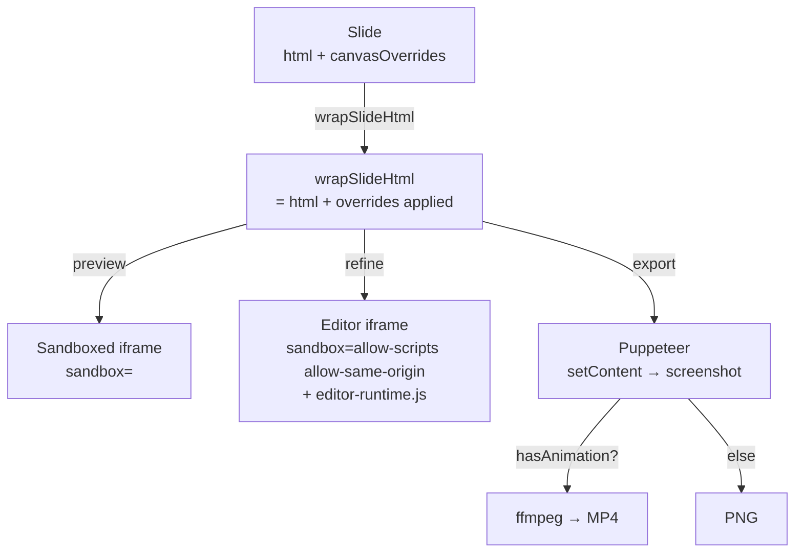

# Canvas Text Editor ("Refine Mode") — Implementation Plan

## 1. Executive summary

- **Building:** A "Refine mode" toggle on the slide preview that turns Claude's HTML into a layered, drag/resize/rotate text-canvas editor. Overrides persist as structured JSON, are applied at render time on top of Claude's HTML, and produce pixel-identical PNG/MP4 export.
- **Explicitly NOT building (v1):** image-layer manipulation, shape/vector primitives, free-draw, color picker for backgrounds, animation timing editor, multi-slide-clipboard, collaborative cursors, real undo across slide-additions/deletions.
- **Single most important architectural decision:** **Overrides live in a new `Slide.canvasOverrides` JSON field. They are applied by `applyOverrides()` during `wrapSlideHtml()` itself.** That keeps `wrapSlideHtml()` as the single rendering contract — preview iframe, PNG export, and MP4 export all see the same merged HTML automatically. Nothing in the export pipeline needs to learn about overrides.
- **Iframe interaction model:** in Refine mode, we render a **second, sandbox-relaxed editing iframe** (`sandbox="allow-scripts allow-same-origin"`) that injects an editor runtime. The view-only preview iframe (`sandbox=""`) stays untouched. Both feed through `wrapSlideHtml()` so WYSIWYG holds.
- **Claude lock:** any slide with a non-empty `canvasOverrides` object is "locked." `chat-system-prompt.ts` lists locked slide IDs and instructs Claude to skip them; the slide PUT endpoint also enforces a server-side guard with an opt-in `force` flag for explicit unlock.

---

## 2. Architecture decisions

### Q1 — How are text layers identified inside Claude's HTML?

**Decision: (a) Auto-detect on enter-edit-mode, walk the DOM, tag every text-bearing element with a stable `data-oc-layer-id`.**

Rationale:
- Claude's existing prompt emits arbitrary HTML — we cannot retroactively force every existing carousel to have `data-layer="title"` attributes, and updating the prompt does nothing for carousels created last week.
- Stable IDs are derived from a deterministic hash of `(tag, css-path, normalized-text)` so a re-walk after an unrelated style change yields the same IDs (key for replay after Claude regenerates HTML — though in our locked model that's mostly defensive).
- We mutate the *editing* DOM only; we do NOT rewrite the stored `slide.html`. The IDs live on the in-memory editor copy and inside `canvasOverrides[layerId]`.

Rejected: requiring Claude to add `data-layer` (b) — fragile, requires a prompt overhaul, breaks all existing slides, doesn't handle nested text spans well.

### Q2 — How are overrides persisted?

**Decision: extend the `Slide` type with a new `canvasOverrides: CanvasOverrides | null` field.** Each layer stores `{ transform, style, text?, kind: 'existing' | 'new' }`.

Rationale:
- Preserves the link to Claude's source HTML, which means re-running Claude (after explicit unlock) cleanly throws away overrides without orphan layers.
- A "frozen snapshot HTML" approach would lose the chat round-trip — Claude could no longer reason about the slide's structure because the body would be stuffed with absolute-positioned divs that look nothing like the original layout.
- New text layers (added in canvas mode) are stored under the same map with `kind: 'new'` and inserted at render time.

Rejected: separate "frozen HTML" — destroys Claude's ability to refine the same slide later, and bloats the JSON file with full duplicates.

### Q3 — How is the canvas-edited slide rendered for export?

**Decision: `wrapSlideHtml()` accepts an optional `overrides` argument and applies them via a string-injection helper before interpolation.**

Rationale: this keeps the contract truly singular. The preview iframe, PNG export, and MP4 export all pass `(html, aspectRatio, { overrides, inlineFontCss })` and get back identical output. Adding override-handling to *every* render call site would scatter the logic and inevitably drift.

Concretely: `wrapSlideHtml()` becomes
```ts
wrapSlideHtml(slideHtml, aspectRatio, {
  inlineFontCss?: string,
  overrides?: CanvasOverrides | null,
  editorRuntime?: boolean,
})
```
and internally calls a pure helper `applyOverrides(slideHtml, overrides) → string`. That helper is also exported for the editor runtime to use when re-applying overrides while editing.

Rejected: applying overrides only in the export pipeline — would mean preview-only render uses different code from export, killing WYSIWYG.

### Q4 — How does drag/resize work inside an iframe?

**Decision: separate edit-mode iframe with `sandbox="allow-scripts allow-same-origin"` that hosts the editor runtime.** Parent renders selection handles + snap guides as an SVG overlay positioned over the iframe (transform-aware), but pointer events are routed via `postMessage` from inside the iframe.

Rationale comparison:
- Option A (handles-in-parent + bbox postMessage every frame) — jittery, especially on retina, and fights iframe scaling. The handles drift visibly during drag because every coordinate round-trip costs a frame.
- Option B (separate non-iframe rendering path) — breaks WYSIWYG: `<style>` tags inside slide HTML would leak into the parent page (no shadow DOM isolation strong enough for arbitrary author CSS, including `* { ... }`). Hard fail.
- **Option C (relaxed sandbox + injected runtime)** — the slide's *inner* HTML cannot contain `<script>` (we still strip them server-side as a defense in depth), but our wrapper script runs because we control `wrapSlideHtml()`. The runtime drives pointer events, applies live transforms via inline CSS, and posts diffs back. Fast, smooth, and the iframe DOM stays the source of truth for layout.

The relaxed sandbox is acceptable because: the HTML is authored by Claude under our prompt (no untrusted user uploads except images); we strip `<script>` tags before persistence; and the iframe still has no network access beyond Google Fonts and `/uploads/`.

Rejected: Options A and B above.

### Q5 — Snap guides + alignment — DOM or SVG overlay?

**Decision: SVG overlay in the parent**, positioned absolutely over the iframe, scaled to match. Lines are drawn fresh per-frame during a drag.

Rationale: SVG renders sub-pixel lines crisper than DOM divs, doesn't trigger layout in the editing iframe (which would cause text reflow on every drag tick), and a single `<svg>` with N `<line>` elements is cheap.

The snap *math* runs in the parent (it already knows every layer's bounding box from the runtime's last `layers:layout` message) and only the resulting snapped delta is sent back into the iframe.

### Q6 — Undo/redo scope

**Decision: per-slide stack, in-memory only, depth 50, cleared on slide change. A *commit* is debounced (350ms) before being pushed onto the persistent JSON.** The persisted `slide.previousVersions` array is reused — but we extend it to store `{ html, overrides }` pairs, not bare HTML.

Rationale: scoping per slide matches user mental model (Cmd-Z while on slide 4 should not affect slide 2). Persisting only on commit keeps the JSON file from being rewritten on every drag tick. Capping depth at 50 is generous for a session; an in-memory stack avoids polluting `previousVersions` (currently capped at `MAX_VERSIONS = 5`) with intermediate drag states.

### Q7 — What does "Lock from Claude" mean in code?

**Decision:** a slide is locked iff `slide.canvasOverrides && Object.keys(slide.canvasOverrides.layers).length > 0`. Two enforcement points:

1. **System prompt (`src/lib/chat-system-prompt.ts`):** the per-slide list now flags locked slides:
   ```
   - Slide 4 (ID: abc) [LOCKED — user-refined in canvas, do not modify]
   ```
   plus a new "## Locked slides" rule paragraph telling Claude not to PUT to those IDs and to suggest the user unlock first.

2. **API guard (`src/app/api/carousels/[id]/slides/[slideId]/route.ts`):** the existing `PUT` handler checks: if the existing slide has overrides AND the request did not pass `?source=canvas` (a header `X-OC-Source: canvas` is cleaner), reject with 423 Locked. The canvas editor sets the header; Claude's curl calls do not.

This is workable: the system-prompt change is additive, the route change is ~15 lines, and the failure mode (Claude tries, gets 423, sees error in stdout, reports to user) is graceful.

---

## 3. Data model changes

**File: `src/types/carousel.ts`**

```ts
export interface LayerTransform {
  x: number;        // px from slide top-left, in slide coords (e.g. 1080-wide)
  y: number;
  w: number;        // px
  h: number;
  rotation: number; // degrees, -180..180
  z: number;        // z-index, integer
}

export interface LayerStyle {
  fontFamily?: string;
  fontSize?: number;       // px
  fontWeight?: number;     // 100..900
  fontStyle?: "normal" | "italic";
  color?: string;          // hex or rgba
  textAlign?: "left" | "center" | "right" | "justify";
  lineHeight?: number;     // unitless
  letterSpacing?: number;  // px
  textTransform?: "none" | "uppercase" | "lowercase" | "capitalize";
}

export type LayerKind = "existing" | "new";

export interface CanvasLayer {
  id: string;                 // stable hash for existing, generated id for new
  kind: LayerKind;
  transform: LayerTransform;
  style: LayerStyle;
  text?: string;              // only set if user edited the text content
                              // (existing layer keeps original text otherwise)
}

export interface CanvasOverrides {
  layers: Record<string, CanvasLayer>; // keyed by layer id
  // IDs in render order (bottom -> top). New layers append. Existing layers
  // start in DOM order; reordering bumps `transform.z`. We keep this list
  // separately so we can render new layers at a deterministic position.
  order: string[];
  schemaVersion: 1;
}

export interface Slide {
  id: string;
  html: string;
  previousVersions: Array<string | { html: string; overrides: CanvasOverrides | null }>;
  // ^ backward compatible: legacy entries are bare strings; new entries are objects.
  order: number;
  notes: string;
  canvasOverrides?: CanvasOverrides | null;  // NEW
}
```

**File: `src/types/canvas.ts` (NEW)**

Holds the postMessage protocol types (see §7) so both runtime and parent can share them.

---

## 4. API surface changes

### Modified: `PUT /api/carousels/[id]/slides/[slideId]`

File: `src/app/api/carousels/[id]/slides/[slideId]/route.ts`

- New body field: `canvasOverrides?: CanvasOverrides | null`.
- Body field `force?: boolean` to bypass lock (canvas editor never sets this; an explicit "Reset & let Claude edit" button does).
- Read `X-OC-Source` header. Values: `"canvas"` (from refine UI), `"chat"` (from Claude's curl), absent treated as `"chat"`.
- Lock check:
  ```ts
  const existing = await getSlide(id, slideId);
  const isLocked = !!existing?.canvasOverrides &&
    Object.keys(existing.canvasOverrides.layers).length > 0;
  if (isLocked && source !== "canvas" && !body.force) {
    return NextResponse.json(
      { error: "Slide is locked by canvas refine mode", code: "SLIDE_LOCKED" },
      { status: 423 }
    );
  }
  ```

### New: `POST /api/carousels/[id]/slides/[slideId]/unlock`

Clears `canvasOverrides` and pushes a history entry. Two query modes: `?keepText=true` (default) keeps the rendered visual by baking overrides into HTML one final time, then clears overrides; `?keepText=false` reverts to Claude's HTML untouched.

Returns the updated slide.

### Modified: `POST /api/carousels/[id]/slides`

Request body adds optional `canvasOverrides` so Claude or duplication can seed a slide with overrides (won't be used in v1 but cheap to add).

### Unchanged but consumes new field

- `POST /api/carousels/[id]/export` and `POST /api/carousels/[id]/slides/[slideId]/export` — unchanged signatures because override-application happens inside `wrapSlideHtml()`. The export functions only have to *pass* `slide.canvasOverrides` along.
- `POST /api/carousels/[id]/slides/[slideId]/video` — same.
- `POST /api/carousels/[id]/slides/[slideId]/undo` — must restore both `html` and `canvasOverrides` from the new history-entry shape.

### `carousels.ts` updates

File: `src/lib/carousels.ts`

- `updateSlide()` accepts `canvasOverrides` in updates. Version-history push records `{ html, overrides }`.
- New helper `setCanvasOverrides(carouselId, slideId, overrides)` for atomic override-only updates (skips html version-history thrashing during drag commits).
- `undoSlide()` reads the structured entry (or back-compat string), restores both fields.

---

## 5. UI components

### New components (all in `src/components/editor/canvas/`)

| File | Lines (target) | Responsibility |
|---|---|---|
| `RefineModeToggle.tsx` | ~60 | Toolbar button. Shows lock badge if slide has overrides. |
| `CanvasEditor.tsx` | ~250 | Top-level editor for one slide. Owns selection, undo stack, snap state. Renders `CanvasIframe` + `SelectionOverlay` + `Inspector`. |
| `CanvasIframe.tsx` | ~180 | The relaxed-sandbox iframe. Wraps `wrapSlideHtml(html, ratio, { overrides, editorRuntime: true })`. Posts/receives messages. |
| `SelectionOverlay.tsx` | ~220 | The SVG overlay over the iframe: selection rectangles, 8 resize handles, rotation handle, snap guide lines. Translates parent-pointer coords back into slide coords using the iframe's scale. |
| `Inspector.tsx` | ~260 | Right-side panel with text/style controls (font, size, weight, color, alignment, line-height, letter-spacing). Shown only in refine mode. |
| `LayersPanel.tsx` | ~180 | Optional left mini-panel (or nested inside Inspector) showing layer list + z-order controls (bring-forward / send-back / delete). |
| `useCanvasUndo.ts` | ~120 | Custom hook: ref-stable undo/redo with debounced commits. |
| `useSnap.ts` | ~150 | Pure-function snap logic: given current dragged layer + sibling bounding boxes, return `{ snappedX, snappedY, guideLines: [] }`. |
| `editor-runtime.ts` | ~250 | The script bundled into the iframe (see §7). Compiled separately from React; kept dependency-free and small. |

### Modified components

- **`CarouselPreview.tsx`** — adds a `mode: 'preview' | 'refine'` prop and a `canvasOverrides` pass-through; in `refine` mode, swaps `<SlideRenderer>` for `<CanvasEditor>`.
- **`SlideRenderer.tsx`** — accepts optional `overrides` prop, passes through to `wrapSlideHtml`.
- **`SlideFilmstrip.tsx`** — show small lock icon on thumbnails for slides with overrides.
- **`src/app/carousel/[id]/page.tsx`** — adds `refineMode` state, lifts active-slide into context, wires `RefineModeToggle` into the toolbar. Disables chat input or shows banner when active slide is locked.

---

## 6. Rendering pipeline



Key: `wrapSlideHtml()` is called identically in three call sites. Overrides are merged inside it, so PNG, MP4, preview, and refine-mode editor all see the same final document. WYSIWYG holds.

### `wrapSlideHtml()` changes (file: `src/lib/slide-html.ts`)

- If `overrides` present: call new helper `applyOverrides(slideHtml, overrides)` *before* the body is interpolated.
- If `editorRuntime` true: append `<script>${EDITOR_RUNTIME_JS}</script>` just before `</body>`. The runtime is read from disk once and cached at module load.

**Build approach:** generated `editor-runtime.bundle.ts` that exports `export const EDITOR_RUNTIME_JS = "..."` to avoid raw-import config gymnastics. A small `scripts/build-editor-runtime.mjs` generates it.

### `applyOverrides()` (new pure helper in `src/lib/canvas-overrides.ts`)

Responsibilities:
1. Walk `slideHtml` (use a tiny regex-based tokenizer; no cheerio dependency — we already accept that the slide HTML is well-formed because Claude generates it). For each text-bearing node, derive its layer id with the same hash function the editor runtime uses.
2. For each layer in `overrides.layers`:
   - If `kind === 'existing'`: inject inline `style="position:absolute; left:{x}px; top:{y}px; width:{w}px; height:{h}px; transform:rotate({r}deg); z-index:{z}; ...font/style overrides..."` and (if `text` set) replace innerText.
   - If `kind === 'new'`: append a fresh `<div data-oc-layer-id="..." style="...">{escaped text}</div>` to the body.
3. Emit a top-of-body `<style>` block defining `[data-oc-layer-id]{ ... }` baseline rules so we don't fight the existing slide CSS.

This helper has zero DOM dependency — pure string-in / string-out — making it trivially unit-testable (see §13).

### Edge case: existing layout stretches

When we promote an existing layer to position:absolute, sibling content collapses. **Decision:** we wrap the original body in a `<div data-oc-original-layout style="position:relative">…</div>` and overlay the absolute layers on top. For layers with overrides, we mark the original element with `visibility:hidden; pointer-events:none` (preserving its layout box) so siblings stay where Claude placed them. For new layers, they're pure absolute overlays.

This trick keeps Claude's design intact for un-overridden layers while letting refined layers go anywhere.

---

## 7. Edit-mode runtime

**File: `src/lib/editor-runtime.ts`** (compiled to a single string and injected by `wrapSlideHtml({ editorRuntime: true })`)

What it does:
1. On `DOMContentLoaded`, walk the body and assign `data-oc-layer-id` to every text-bearing element using the same deterministic hash as `applyOverrides()`.
2. Measure each layer's bounding rect (relative to body, in slide coords) and post `layers:init` to parent.
3. Listen for parent → iframe messages: `select`, `transform-preview`, `style-preview`, `text-edit`, `add-text-layer`, `delete-layer`, `set-overrides` (full re-render).
4. Forward iframe → parent: `pointer-down` (with hit-test result), `pointer-move` (during drag), `pointer-up` (final transform), `dblclick-text` (enter inline-edit mode).
5. Implement minimal hit-testing using the layer rects already measured.
6. For inline text editing: make the hit element `contenteditable=true` on dblclick, post `text-edit` on blur with the new text content.

### postMessage protocol

All messages are `{ type: string, payload: any, requestId?: string }` JSON.

Parent → iframe:
- `oc:editor:init` `{ overrides }` — initial sync after frame loads
- `oc:editor:set-selection` `{ ids: string[] }`
- `oc:editor:apply-transform` `{ id, transform }` — live update during drag
- `oc:editor:apply-style` `{ id, style }`
- `oc:editor:apply-text` `{ id, text }`
- `oc:editor:add-layer` `{ layer: CanvasLayer }`
- `oc:editor:delete-layer` `{ id }`
- `oc:editor:set-z-order` `{ id, direction: 'forward' | 'back' | 'top' | 'bottom' }`
- `oc:editor:request-snapshot` — for save / undo capture

Iframe → parent:
- `oc:editor:ready` `{ slideW, slideH }`
- `oc:editor:layout` `{ layers: Array<{ id, rect, kind }> }` — sent after init and after any layout-affecting change
- `oc:editor:pointer-down` `{ id | null, clientX, clientY, modifiers }`
- `oc:editor:pointer-move` `{ deltaX, deltaY, clientX, clientY, modifiers }`
- `oc:editor:pointer-up` `{ committedTransform: { id, transform } | null }`
- `oc:editor:dblclick-text` `{ id }`
- `oc:editor:text-edit` `{ id, text }` (after contenteditable blur)
- `oc:editor:snapshot` `{ overrides }` (response to request-snapshot)

The runtime never persists anything; the parent owns state and pushes changes back.

Origin check: parent uses `iframe.contentWindow === ev.source` to validate; the iframe uses `parent === ev.source`. Since `srcDoc` iframes inherit `null` origin, we use `*` for `postMessage` targetOrigin (acceptable because the iframe is fully isolated by sandbox + we control the only injected script).

---

## 8. Snap guides + interaction details

### Drag

1. `pointer-down` on a layer in the iframe → runtime hit-tests, posts to parent.
2. Parent records starting positions for selected layer(s).
3. Each `pointer-move`: parent computes new transform, runs `useSnap()` against bounding boxes of all *other* layers (cached from last `layers:layout`), and the slide bounds (left/center/right edges + top/middle/bottom + percentage gridlines).
4. `useSnap()` returns adjusted `(x, y)` and the list of guide lines (vertical/horizontal segments) that triggered.
5. Parent posts `apply-transform` to iframe (which moves the element) AND updates the SVG overlay with the guide lines.
6. On `pointer-up`: parent commits the final transform, pushes onto the undo stack (debounced), and (after debounce) PUTs the new overrides.

Snap threshold: 6 px in slide coordinates. Hold `Alt` to disable snapping for the duration of the drag.

### Resize

8 handles drawn by `SelectionOverlay`. Pointer interactions happen on the *parent's* SVG. Resizing computes new `w`, `h`, and `(x, y)` based on which handle is dragged. Hold `Shift` for aspect-ratio lock.

### Rotation

Handle 30 px above the top-center handle. Drag computes angle from layer center; `Shift` snaps to 15°.

### Multi-select

`Shift+click` on a layer adds/removes it from selection. Marquee drag (start on empty area) drawn by parent SVG; on release, layers whose bounding box intersects the marquee rect become the selection.

Group drag: applies the same delta to every selected layer's `transform.x`/`y`. No scaling on group resize in v1.

Group align toolbar (in Inspector): align-left/center/right/top/middle/bottom and distribute-horizontal/vertical, computed from the bounding boxes of selected layers.

### Keyboard

- Arrow keys: nudge 1px (Shift+Arrow: 10px)
- Delete/Backspace: delete selected layers
- Cmd/Ctrl+Z / Cmd/Ctrl+Shift+Z: undo/redo
- Cmd/Ctrl+D: duplicate selected
- Cmd/Ctrl+]: bring forward; Cmd/Ctrl+[: send back
- Esc: clear selection / exit refine mode (with confirm if dirty)
- Double-click on text layer: inline edit
- T: insert new text layer at cursor position

---

## 9. Persistence & undo/redo

### Override JSON shape

Already covered in §3. Stored under `slide.canvasOverrides`. Empty/null overrides means "not refined." Empty `layers` object also means "not refined."

### Save triggers

- **Live drag/resize/rotate:** posts to runtime *only* (no fetch). Updates parent's `pending` overrides.
- **350ms debounce after pointer-up or any single-shot change (style edit, add layer, delete):** push entry to in-memory undo stack + PUT to API.
- **Explicit Save button (subtle, in toolbar):** force-flush.
- **Slide change / refine mode exit:** flush pending immediately.
- **Window unload:** `navigator.sendBeacon` of pending overrides as a last-ditch save.

### Undo/redo

`useCanvasUndo` keeps two arrays of `CanvasOverrides` snapshots in a `useRef` (avoid re-renders). Each commit clones the current overrides and pushes to `past`. Undo pops from `past`, pushes current to `future`, and applies. Redo mirrors it.

Cap depth at 50; `past.shift()` when exceeded.

Undo stack is **per-slide and ephemeral** (lost on slide change). The persisted `previousVersions` (capped at `MAX_VERSIONS = 5`) provides cross-session undo at coarser grain. Documented limitation.

---

## 10. Conflict resolution with Claude chat

### Lock representation

A slide is locked iff `slide.canvasOverrides && Object.keys(slide.canvasOverrides.layers).length > 0`.

### Where the check lives

1. **`src/lib/chat-system-prompt.ts`** — modify the per-slide listing in `carouselSection`:
   ```ts
   carousel.slides.map((s) => {
     const locked = s.canvasOverrides && Object.keys(s.canvasOverrides.layers).length > 0;
     return `  - Slide ${s.order + 1} (ID: ${s.id})${locked ? " [LOCKED — user-refined in canvas, do not modify or delete]" : ""}${s.notes ? ` — ${s.notes}` : ""}`;
   }).join("\n")
   ```
   Add a new behavioral rule:
   > **Locked slides:** Some slides above are marked `[LOCKED]`. The user has hand-refined them in canvas mode. Do NOT update or delete locked slides. If asked to change one, respond: "Slide N is locked from canvas edits. Unlock it via the canvas toolbar to let me modify it." You CAN reference locked slides for context when designing new slides.

2. **`src/app/api/carousels/[id]/slides/[slideId]/route.ts`** — the PUT handler:
   ```ts
   const source = request.headers.get("X-OC-Source") ?? "chat";
   const existing = (await getCarousel(id))?.slides.find((s) => s.id === slideId);
   const isLocked = existing?.canvasOverrides &&
     Object.keys(existing.canvasOverrides.layers).length > 0;
   if (isLocked && source !== "canvas" && !body.force) {
     return NextResponse.json(
       { error: `Slide ${slideId} is locked by canvas refine mode. POST to /unlock first.`, code: "SLIDE_LOCKED" },
       { status: 423 }
     );
   }
   ```
   The DELETE handler gets the same guard.

3. **Canvas editor's fetch helper** — sets `X-OC-Source: canvas` header on every PUT.

4. **Editor UI** — when active slide is locked AND chat input is focused, show a small "Slide is locked from chat — [Unlock]" banner above the chat panel. Clicking unlock calls the new `POST /unlock` endpoint.

---

## 11. Implementation phases

Each phase is shippable on its own (the app keeps working if we stop here).

### Phase 1 — Data model + render pipeline (foundation)
**No user-visible changes. Defensive groundwork.**

- Add `CanvasOverrides` types to `src/types/carousel.ts`.
- Create `src/lib/canvas-overrides.ts` with `applyOverrides()` (pure string transformer) + `hashLayerId()` shared helper.
- Update `wrapSlideHtml()` signature to accept `overrides` and call `applyOverrides()` when present.
- Update `carousels.ts` (`updateSlide`, `undoSlide`, `addSlide`) to round-trip the new field.
- Update `previousVersions` shape with back-compat reader.
- Update `export-slides.ts` and `export-video.ts` to pass `slide.canvasOverrides` into `wrapSlideHtml()`.
- Unit tests for `applyOverrides()` (see §13).

**Effort: 6–8 hours.** Risk: low. Touches the rendering contract — must not regress existing carousels.

### Phase 2 — Edit-mode iframe + runtime + postMessage plumbing
**Adds invisible plumbing. Refine button still hidden.**

- Build `src/lib/editor-runtime.ts` (DOM walk, layer tagging, hit testing, postMessage emit/listen, contenteditable hookup).
- Add `scripts/build-editor-runtime.mjs` to compile into a string bundle.
- Wire into `wrapSlideHtml({ editorRuntime: true })`.
- Build `CanvasIframe.tsx` shell: relaxed sandbox, message bus, ready handshake.
- Build `useCanvasMessages.ts` hook for typed message passing.
- Manual harness: a hidden `?refine=1` URL param renders `CanvasIframe` for the active slide; verify selection and bounds appear in console.

**Effort: 10–12 hours.** Risk: medium — sandbox + postMessage edge cases (Safari quirks, iframe load timing).

### Phase 3 — Selection, drag, resize, rotate (single layer)
**MVP refine mode shipped. Hidden behind feature flag.**

- Build `SelectionOverlay.tsx` (SVG handles, transform-aware coordinate translation).
- Drag: pointer-down → pointer-move → pointer-up flow, no snapping yet.
- Resize: 8 handles, aspect lock with Shift.
- Rotate: top handle, 15° snap with Shift.
- Build `Inspector.tsx` skeleton with text style controls.
- Build `RefineModeToggle.tsx` and wire into `CarouselPreview` + page.
- Hook `useCanvasUndo` for in-memory undo/redo (Cmd-Z works).
- Debounced PUT to `/api/.../slides/[slideId]` with `X-OC-Source: canvas`.

**Effort: 14–18 hours.** Risk: medium — coordinate math + iframe scaling is fiddly.

### Phase 4 — Snap guides, multi-select, new layers, delete, z-order
**Refine mode becomes pleasant.**

- Build `useSnap.ts` and SVG guide rendering.
- Multi-select (shift+click + marquee), group drag.
- Align/distribute toolbar.
- "Add text layer" interaction (T key, click-empty + type).
- Delete layer.
- Bring-forward / send-back.
- Inline text editing (dblclick → contenteditable → blur commit).
- Layers panel.

**Effort: 12–16 hours.** Risk: low–medium.

### Phase 5 — Lock from Claude
**Closes the conflict loop.**

- Update `chat-system-prompt.ts` with locked-slide listing + behavioral rule.
- Add 423 lock guard in `[slideId]/route.ts` PUT and DELETE handlers.
- Add `X-OC-Source: canvas` header in canvas editor fetches.
- Add `POST /api/carousels/[id]/slides/[slideId]/unlock` endpoint.
- Lock badge on filmstrip thumbnails.
- "Slide locked from chat" banner in chat panel.
- "Reset to original / Unlock" button in refine toolbar.

**Effort: 5–7 hours.** Risk: low.

### Phase 6 — Polish, edge cases, export verification
**Production-ready.**

- Visual diff PNGs of preview vs export for every fixture slide.
- Empty-slide edge cases (no text layers).
- Very small layers (handles overlap).
- Long slides at 9:16 ratio.
- Rotated layers + bbox math fixes.
- Unsaved-changes dialog on slide change with pending edits.
- Keyboard shortcut help overlay.
- Performance: throttle `apply-transform` to 60 fps during drag.
- Remove feature flag.

**Effort: 8–10 hours.** Risk: low (mostly polish).

**Total estimated effort: 55–71 hours** (~7–9 focused days).

---

## 12. Risks & open questions

### Known risks

1. **Iframe scaling artifacts.** `SlideRenderer` already uses `transform: scale()` on the iframe. Pointer coordinates have to be inverse-scaled in the parent before being interpreted as slide coords. Off-by-pixel issues are likely on first attempt; budget extra time in Phase 3.

2. **Original-layout preservation.** The "hide-original-but-keep-bounding-box" trick (visibility:hidden) works for static layouts but breaks if Claude used flexbox `gap` or grid. For v1 we accept that pathological layouts may slightly shift; add a "snapshot original layout" rendering toggle to Inspector for power users.

3. **Layer-id stability.** If Claude refines a slide and an existing layer's text changes, our hash function (which incorporates normalized text) will produce a new ID and the override gets orphaned. **Mitigation:** in v1 a refined slide is locked, so this never happens in practice. If we later allow merging, we'll need a fuzzy match step.

4. **`<script>` injection trust boundary.** Relaxing the sandbox to `allow-scripts allow-same-origin` for the edit iframe means a malicious slide HTML could exfiltrate cookies *of the same origin*. Since Open Carrusel is a single-tenant local app and slide HTML comes from Claude (not arbitrary users), risk is low. **Mitigation:** strip `<script>` tags from `slide.html` server-side in `addSlide`/`updateSlide` *for the chat path* before persistence (Claude shouldn't be emitting script anyway). The editor runtime is the only allowed script.

5. **Puppeteer + `<script>` execution.** `wrapSlideHtml({ editorRuntime: true })` should NEVER be called from the export path. We must add a defensive check in `export-slides.ts` and `export-video.ts` to ensure they always pass `editorRuntime: false` (or omit). A failing `expect(html).not.toContain("EDITOR_RUNTIME")` test in Phase 1 catches regressions.

6. **Undo across sessions.** Per-slide ephemeral undo doesn't survive reload. Documented.

7. **MP4 export of refined slides.** Animation detection (`hasAnimation()`) currently scans `slide.html`. After overrides are applied, the merged HTML still contains the original `@keyframes` rules so detection still works. Verify in Phase 6.

8. **Long text reflow inside fixed-size layers.** When user resizes a text layer smaller than its content, text overflows. v1: clip with `overflow:hidden`. v1.1 candidate: auto-shrink font size.

### Open questions to flag to user

- Do we want a small "Refined" indicator on the public PNG/video output, or is the lock purely internal? (Default: internal only.)
- Should `Reset to original` also clear the slide's `previousVersions` (the locked snapshot moves there)? Recommendation: yes, push current state to `previousVersions` so undo still gets you back.
- Is there a need to "merge" Claude's edits with canvas overrides (re-base)? User wording — "separate refine mode that locks Claude out" — says no. Confirmed.

---

## 13. Testing approach

### Unit tests (worth writing — `src/lib/canvas-overrides.test.ts`)

- `applyOverrides(html, null)` returns `html` unchanged.
- `applyOverrides(html, { layers: {} })` returns `html` unchanged.
- A single existing-layer override emits `data-oc-layer-id` + inline style with the right transform.
- A new layer appends a `<div>` at the body end with text + style.
- Order array determines z-index correctly.
- `hashLayerId()` is stable across re-walks (same input → same id).
- `wrapSlideHtml` regression: with `editorRuntime: false` (default), output contains no `<script>` tag.

### Manual checks per phase

**Phase 1:** existing carousels still render and export identically (byte-compare PNG buffers from a fixture set).

**Phase 2:** open `?refine=1`, see `[oc:editor:ready]` in console, click a layer and see hit-test logged.

**Phase 3:** drag a layer, refresh page, layer is in new position. Export PNG matches the on-screen position to ±1 px.

**Phase 4:** drag near another layer's edge, snap line appears, snap engages. Multi-select 3 layers, drag, all move together. Add new text layer, type, exports correctly.

**Phase 5:** ask Claude in chat "make slide 1 more minimal" when slide 1 is locked → Claude responds with "locked" message. Click unlock → Claude can modify again.

**Phase 6:** byte-compare preview screenshot vs. server-exported PNG for 5 fixture slides covering all aspect ratios + animation + rotation + multi-layer.

### Integration smoke test (worth automating in Phase 6)

A Puppeteer script that:
1. Opens a fixture carousel
2. Toggles refine mode on slide 2
3. Sends synthetic mouse drag events into the iframe via `page.mouse.*`
4. Triggers a save
5. Re-fetches `slide.canvasOverrides` and asserts it matches expected
6. Hits the export endpoint and pixel-diffs against a golden PNG

---

## 14. Estimated effort recap

| Phase | Hours | Cumulative |
|---|---|---|
| 1. Data model + render pipeline | 6–8 | 6–8 |
| 2. Edit iframe + runtime + plumbing | 10–12 | 16–20 |
| 3. Selection, drag, resize, rotate | 14–18 | 30–38 |
| 4. Snap, multi-select, new layers, z-order | 12–16 | 42–54 |
| 5. Lock from Claude | 5–7 | 47–61 |
| 6. Polish, edge cases, export verification | 8–10 | 55–71 |

**Realistic total: 55–71 hours of focused work** (~1.5–2 weeks at 6 productive hours/day, including the inevitable iframe-coordinate-math debugging session).
